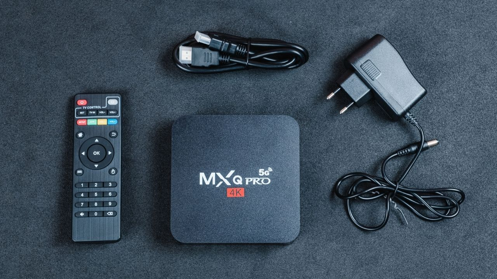

# RK322X Armbian Home Server

> ### **Tirar leite de pedra**
> */ti.'ɾaɾ 'lej.tʃi dʒi 'pɛ.dɾɐ/*
>
> **Expression** (Brazilian Portuguese)
> 1. To perform an extremely difficult task with very limited resources.
> 2. To extract the maximum possible performance out of outdated or low-end hardware.
> 3. *Literal translation: "To milk a stone".*

This project is intended to be a personal challenge, as well as a step by step guide for those who are interested in building a low-energy, fully-fledged domestic server



## Index
- [Hardware Stack](#hardware-stack)
- [Images](#images)
- [Architecture and Goals](#architecture-and-goals)
- [Hardware Preparation](#hardware-preparation)
- [Honorable Mentions](#honorable-mentions)

## Hadware Stack

We'll be using:
- **Nodes:** 3x MXQ Pro TV Boxes (Rockchip RK322x - 1GB RAM / 8GB eMMC)
- **Network:** 1x Intelbras SF 800Q+ FastEthernet Switch
- **Storage**: 1x Generic Sata M/M USB 3.0 Adapter and 1x Samsung 2.5" 1TB HDD
- **Router**: 1x TP-Link WR740N with OpenWRT
- **Gateway:** 1x Archer C3 Domestic Router 

Despite the high targeted software goal, the hardware will be simplified to things I already have at home, or cheap devices/tools I can easily find locally

## Images

The main image used can be downloaded with: 
```bash
wget https://users.armbian.com/users.armbian.com/jock/web/rk322x/armbian/stable/Armbian_22.02.0-trunk_Rk322x-box_bullseye_legacy_4.4.194_minimal.img.xz
```

For the Multitool installation image download:
```bash
wget https://users.armbian.com/users.armbian.com/jock/web/rk322x/multitool/multitool.img.xz
```

Respectivelly, the SHA512 signatures are:
```bash
044c5b1f3e1ca2545d8e71ec321576cb132c8a3b75e2a5b5fecd4bd563c48bc1a80e8bdb5092330f130228af2acaaf69d9370d067fc7e4c98b44de3b4da6e921  Armbian_22.02.0-trunk_Rk322x-box_bullseye_legacy_4.4.194_minimal.img.xz

49c56ea7f84b08e04f4d897673fc5f1498c6bb800ff8ca8ee9219ed6029557e5d66a9fff81fedf9a161b39f5467a10671b86be19948bf2f0d15b3704a5b9e1ba  multitool.img.xz
```

Armbian 22.02.0 with Linux Kernel 4.4.194 was chosen because it's the newest I managed to run during testing

### Disclaimer:
**I am not responsible for building, compiling or maintaing any of the above images. Use them at your own risk**

## Architecture and Goals

Besides the technical challenge, the goals include easing daily tasks, backups and cross-platform synchronization and my overall security hardening and enhancing

### Environment and Network:
- **Armbian** - Well documented for Rockchip CPUs
- **OpenWRT** - VLAN segmentation, NAT, Edge Firewall and DMZ implementation for safe internet access
- **FTP + SMB + SSH + NFS** - Basic management services
- **Wireshark** - Packet analyzer
- **Unbound / CoreDNS** - Local DNS Server
- **Nginx** - Integration with TV's Kodi App / Easy file sharing within devices

### Services:
- **Docker** - Docker Swarm for Cluster integration/control / Easy service and software management 
- **Torsocks** - Will be used as a VPN despite low speed
- **Tailscale** - Opening to the Internet
- **Pi-Hole / AdGuard Home** - Ad-blocking in LAN
- **Jellyfin** + Jellyseer - Content Streaming and Management
- **Nextcloud** - Cloud Services
- **Synthing** - Synchronization Services
- **Gitea** - Project Versioning
- **Aria2ng** - Download Manager
- **QBittorrent** - Torrent Manager and Seedbox

### QoL:
- **Heimall** - Dashboarding
- **Stress-NG** - Stress testing
- **Prometheus + Grafana / Netdata** - Metrics gathering
- **Restic** - Backup Services
- **MergerFS + SnapRAID / Btrfs + RAID 1** - NAS 

### Security:
- **OpenVAS** - Automated Vulnerability Scanner
- **Lynis** - Compliance and System Configuration auditor
- **ClamAV** - Heuristic and Signature based Antivirus
- **pfSense** - Firewall
- **ELK Stack + Snort/Suricata** - SIEM with IDS/IPS Monitoring
- **Authelia** - Authentication Manager
- **Nginx Proxy Manager** - Reverse Proxying the Network
- **ModSecurity** - WAF

Minimalism (specially CLI) will be given preference over cutting-edge functionality for obvious reasons. I am conscious that most of services listed above will probably be changed

If one or more services are not possible because of network or hardware limitation, I'll make my own

Concerning security and learning, I'll also report any attempted Pentests against the server by me or my friends on this guide

Security measures will be arbitrarily implemented at the very end of configuration due to security testing, so will opening to the internet
## Hardware Preparation

## Honorable Mentions

This project would not be possible without the following books/guides that inspired me:
- Computer Networks: A Top-Down Approach - Kurose & Ross
- Applied Network Security Monitoring - Sanders & Smith
- Servidores Linux: Guia Prático - Morimoto
- The Hitchhiker's Guide to Anonimity - AnonymousPlanet

and the various guide in the [Useful Links](./useful-links) file 
